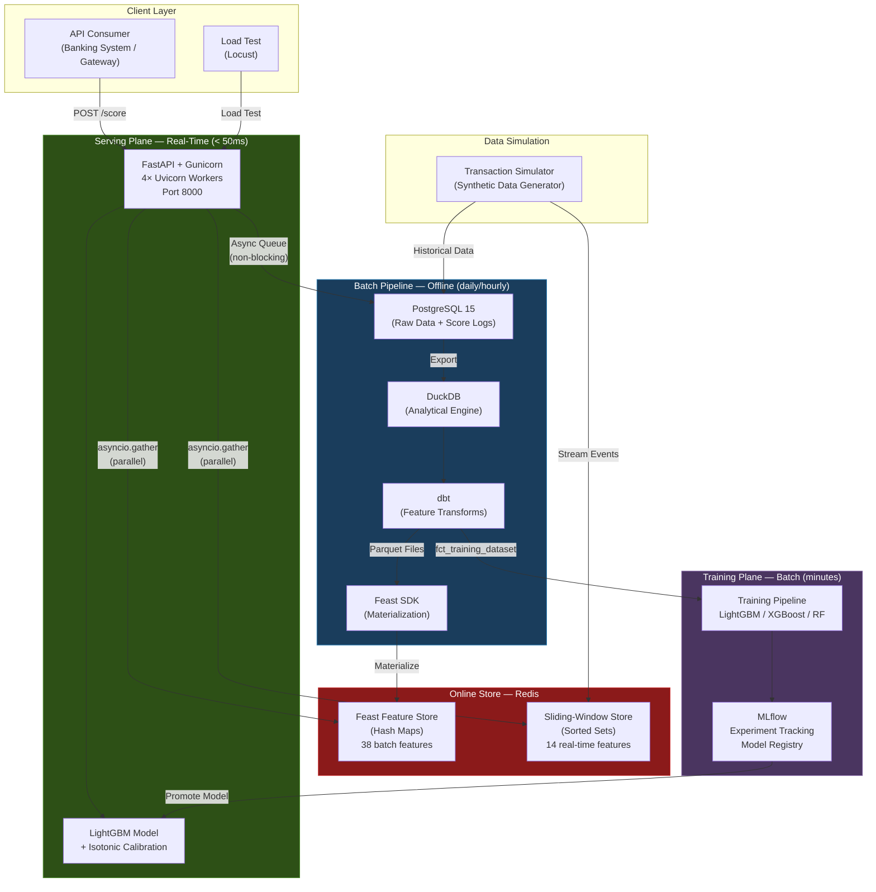

# System Architecture — Fraud Real-Time ML Prototype

## Overview

This prototype demonstrates a **production-grade, real-time fraud scoring platform** built with open-source components. It is designed to score transactions in **< 50ms at 500+ RPS** while supporting concurrent model training without performance degradation.

The architecture follows a **dual-speed feature** pattern used by leading fintechs: batch features (staleness: hours) combined with real-time sliding-window features (staleness: milliseconds).

---

## High-Level Architecture



---

## Component Summary

| Component | Technology | Role | Port |
|-----------|-----------|------|------|
| **Scoring API** | FastAPI + Gunicorn (4 workers) | Real-time fraud scoring | 8000 |
| **Online Store** | Redis 7 (Alpine) | Feature serving (batch + real-time) | 6379 |
| **Raw Data Store** | PostgreSQL 15 | Transaction data, score logs | 5432 |
| **Analytics Engine** | DuckDB | Offline feature computation | — |
| **Feature Transforms** | dbt (DuckDB adapter) | SQL-based feature engineering | — |
| **Feature Store** | Feast (Redis online store) | Feature materialization + registry | — |
| **ML Training** | LightGBM / XGBoost / RF | Model training + calibration | — |
| **Experiment Tracking** | MLflow | Model registry, metrics, artifacts | 5000 |
| **Load Testing** | Locust | Performance benchmarking | 8089 |

---

## Design Principles

### 1. Separation of Serving and Training Planes
The scoring API and training pipeline operate **independently**. Training reads from DuckDB (offline), scoring reads from Redis (online). This means you can retrain models without affecting API latency.

### 2. Dual-Speed Feature Architecture
- **Batch features** (38 features): User profiles, 1d/7d/30d aggregates → computed by dbt, materialized to Redis via Feast
- **Real-time features** (14 features): 5m/10m/1h sliding windows → computed directly in Redis sorted sets

### 3. Async-First Serving
- All I/O is async (`asyncio`, `asyncpg`, `redis.asyncio`)
- Feature fetches run in parallel via `asyncio.gather`
- Score and feature logging is non-blocking (async queue → batch insert)
- Model inference runs in a `ThreadPoolExecutor` (LightGBM releases the GIL)

### 4. Redis as the Single Serving Source
Both batch (Feast) and real-time features are served from Redis. No cold-start latency, no network hops to multiple stores. Single-digit millisecond feature retrieval.

---

## Data Flow Summary

```
┌─────────────────────────────────────────────────────────────────┐
│                    REAL-TIME PATH (< 50ms)                      │
│                                                                 │
│   Request → [API] → asyncio.gather(                             │
│                        fetch_offline(Redis/Feast),              │
│                        fetch_online(Redis/SortedSets)           │
│                     )                                           │
│             → [ThreadPool] predict_proba + np.interp            │
│             → Response {score, risk_band, is_flagged}           │
└─────────────────────────────────────────────────────────────────┘

┌─────────────────────────────────────────────────────────────────┐
│                   BATCH PATH (hourly/daily)                     │
│                                                                 │
│   Postgres → DuckDB → dbt (staging→intermediate→features)      │
│            → Parquet → Feast materialize → Redis                │
└─────────────────────────────────────────────────────────────────┘

┌─────────────────────────────────────────────────────────────────┐
│                   TRAINING PATH (on-demand)                     │
│                                                                 │
│   DuckDB(fct_training_dataset) → Parquet                        │
│   → train_model.py (config-driven) → MLflow (log metrics)      │
│   → promote_model.py → models/ → API hot-reload                │
└─────────────────────────────────────────────────────────────────┘
```

---

## Tech Stack at a Glance

| Layer | Choice | Why |
|-------|--------|-----|
| API Framework | FastAPI | Async-native, automatic OpenAPI docs, Pydantic validation |
| ASGI Server | Gunicorn + Uvicorn workers | Multi-process + async I/O |
| ML Model | LightGBM | Fast inference (~1ms), GIL-free, production-proven |
| Calibration | Isotonic (extracted) | Accurate probability calibration without sklearn overhead |
| Online Store | Redis | Sub-millisecond reads, sorted sets for sliding windows |
| Offline Store | DuckDB | Columnar analytics, zero-config, 10-100× faster than Postgres for OLAP |
| Feature Transforms | dbt | SQL-based, version-controlled, testable, incremental |
| Feature Store | Feast | Entity-centric features, materialization pipeline, registry |
| Experiment Tracking | MLflow | Metrics logging, model registry, artifact storage |
| Score Logging | asyncpg → PostgreSQL | Async batch insert, training-serving consistency |
