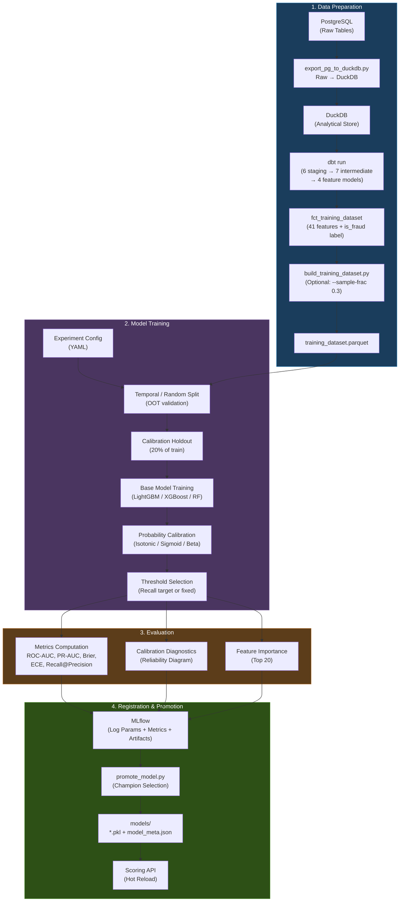
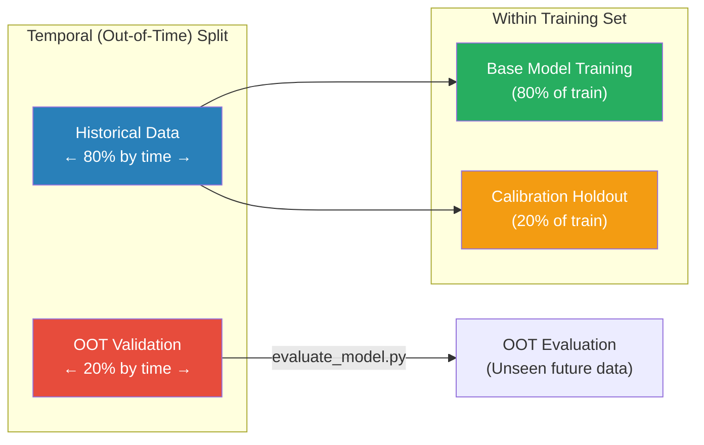
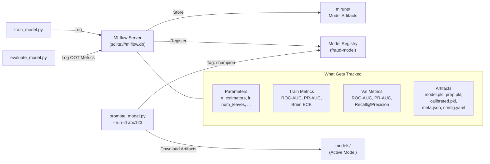
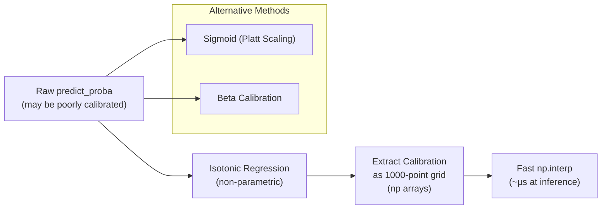

# Training Pipeline — Fraud Real-Time ML Prototype

## Overview

The training pipeline is **config-driven** and **MLflow-integrated**. A single YAML config file controls the model type, hyperparameters, preprocessing, calibration strategy, and evaluation criteria. All experiments are tracked in MLflow with full reproducibility.

---

## Training Pipeline Flow



---

## Experiment Configuration (YAML-Driven)

All training parameters are defined in a single YAML file under `training/experiments/`:

```yaml
# training/experiments/lgbm_optimized_hyperparams.yaml
model:
  type: lightgbm                    # lightgbm | xgboost | random_forest
  params:
    n_estimators: 3000
    num_leaves: 127
    learning_rate: 0.01
    min_child_samples: 10
    reg_alpha: 0.1
    reg_lambda: 5.0
    metric: average_precision
    early_stopping_rounds: 100

preprocessing:
  numeric:
    strategy: passthrough           # passthrough | standard_scaler | minmax | robust
  categorical:
    strategy: passthrough           # passthrough | ordinal | one_hot

calibration:
  method: isotonic                  # isotonic | sigmoid | beta
  fraction: 0.20                    # fraction of train set held for calibration

split:
  method: temporal                  # temporal | random
  test_size: 0.20
  temporal_quantile: 0.80           # use top 20% as OOT validation

threshold:
  method: recall_target             # recall_target | fixed
  recall_target: 0.80              # find threshold achieving 80% recall

output_name: lgbm_optimized_model
```

---

## Training Data Split Strategy



**Why Temporal Split?** Fraud patterns evolve over time. A temporal (OOT) split simulates real-world deployment where the model always scores **future** transactions it hasn't seen during training. This gives a more honest estimate of production performance than random splits.

---

## Model Artifacts

Each training run produces 4 files:

| File | Contents |
|------|----------|
| `{name}.pkl` | Base LightGBM model (uncalibrated) |
| `{name}_calibrated.pkl` | `CalibratedClassifierCV` wrapper |
| `{name}_prep.pkl` | `ColumnTransformer` preprocessor |
| `model_meta.json` | Feature list, threshold, metrics, split config, MLflow run ID |

### model_meta.json Example
```json
{
  "model_name": "lgbm_optimized_model",
  "model_type": "lightgbm",
  "feature_cols": ["txn_amount", "is_international", "local_hour", "user_account_age_days", ...],
  "threshold": 0.006463,
  "calibration": {"method": "isotonic", "fraction": 0.20},
  "val_metrics": {"roc_auc": 0.7288, "pr_auc": 0.4683, "brier_score": 0.0089},
  "mlflow_run_id": "abc123..."
}
```

---

## MLflow Integration



### Key MLflow Commands

```bash
# View experiment history
make mlflow-ui              # Opens http://localhost:5000

# List recent runs with metrics
make list-models

# Promote a run to active model
make promote-model RUN_ID=<run_id>

# Set model aliases (champion/challenger/archived)
make alias-model MODEL=fraud-model VERSION=3 ALIAS=champion
```

---

## Supported Model Types

| Model | Config Key | Inference Time | Training Time (50K rows) |
|-------|-----------|---------------|--------------------------|
| **LightGBM** | `lightgbm` | ~1ms | ~30s |
| **XGBoost** | `xgboost` | ~2ms | ~45s |
| **Random Forest** | `random_forest` | ~5ms | ~60s |

---

## Calibration Pipeline



**Key optimization**: At model load time, the isotonic calibration mapping is extracted from sklearn's `CalibratedClassifierCV` into plain numpy arrays. At inference, `np.interp()` replaces the full sklearn predict call — reducing calibration from **15-40ms to < 0.01ms**.

---

## Quick Reference

```bash
# Full pipeline: data → features → train → evaluate
make train CONFIG=training/experiments/lgbm_optimized_hyperparams.yaml

# Train only (reuse existing dataset)
make train-only CONFIG=training/experiments/lgbm_v1.yaml

# Train with subsampled data (faster iteration)
make train SAMPLE=0.3

# Train with CPU isolation (won't affect serving)
make train-isolated CONFIG=training/experiments/lgbm_v1.yaml

# Evaluate an existing model on OOT data
python training/evaluate_model.py
```
