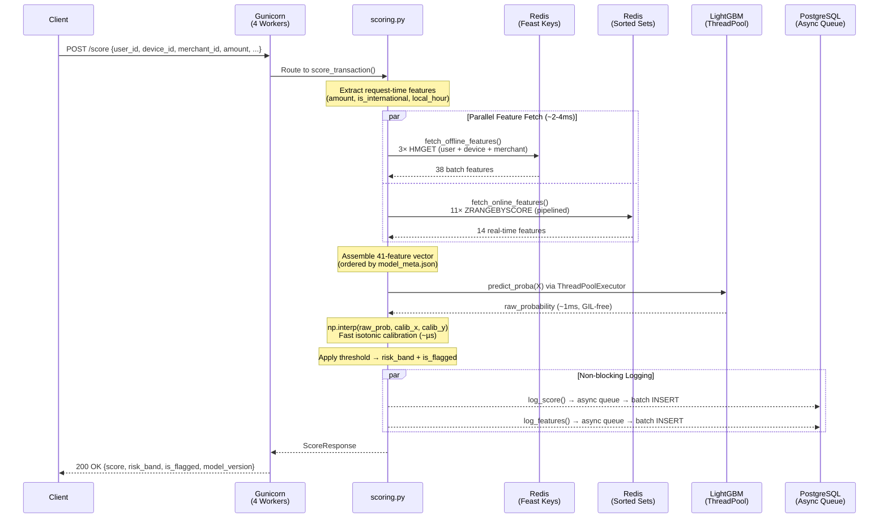
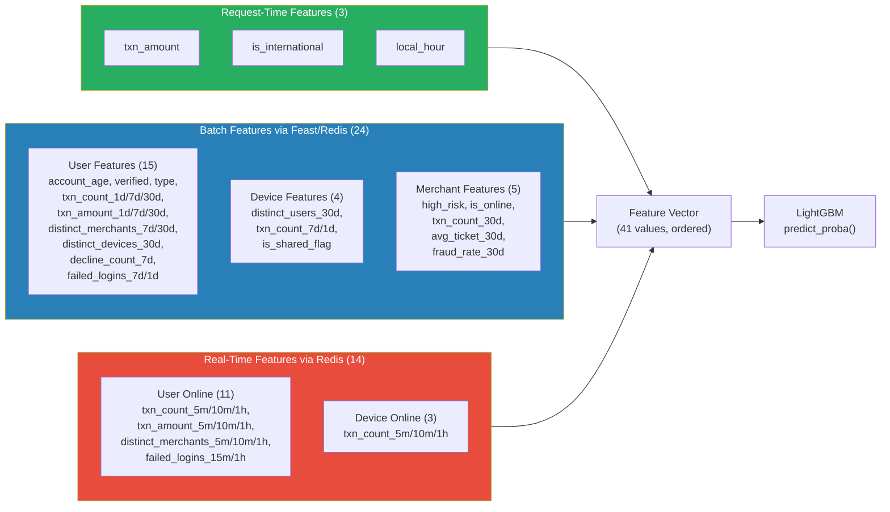
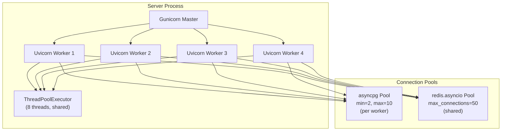

# Scoring & Serving — Fraud Real-Time ML Prototype

## Overview

The scoring service is a **FastAPI application** served by Gunicorn with 4 Uvicorn async workers. It processes `POST /score` requests in **< 50ms end-to-end**, achieving **500+ RPS** on a single server.

Every component in the request path is optimized for low latency: async I/O, parallel feature fetches, pipelined Redis reads, thread-pooled model inference, and non-blocking score logging.

---

## Request Lifecycle



---

## Latency Breakdown

```mermaid
gantt
    title Scoring Request Timeline (typical ~8-15ms server-side)
    dateFormat X
    axisFormat %L ms

    section Feature Fetch
    Offline features (Redis/Feast)     :0, 3
    Online features (Redis/SortedSets) :0, 3

    section Inference
    LightGBM predict_proba             :3, 4
    Isotonic calibration (np.interp)   :4, 4

    section Response
    Threshold + risk band              :4, 5
    Build response                     :5, 5

    section Async (non-blocking)
    Score logging to Postgres           :5, 8
    Feature logging to Postgres         :5, 8
```



| Stage | Latency | How |
|-------|---------|-----|
| **Feature fetch (offline)** | ~2ms | Direct Redis HMGET, bypasses Feast SDK, per-entity TTL cache |
| **Feature fetch (online)** | ~2ms | 11 ZRANGEBYSCORE commands in 1 Redis pipeline |
| **Model inference** | ~1ms | LightGBM releases GIL, runs in ThreadPoolExecutor |
| **Calibration** | ~0.01ms | Pre-extracted numpy arrays + `np.interp` |
| **Score logging** | 0ms (async) | Non-blocking queue, batch INSERT every 50ms |
| **Total server-side** | **~3-8ms** | Parallel fetches + thread-pooled predict |

---

## API Endpoints

### `POST /score` — Score a Transaction

**Request:**
```json
{
    "transaction_id": "txn_abc123",
    "user_id": "u_000042",
    "device_id": "d_0001234",
    "merchant_id": "m_00150",
    "amount": 1250.00,
    "currency": "USD",
    "payment_method": "credit_card",
    "country_code": "US",
    "is_international": true,
    "local_hour": 14
}
```

**Response:**
```json
{
    "transaction_id": "txn_abc123",
    "score": 0.7234,
    "risk_band": "high",
    "is_flagged": true,
    "model_version": "lgbm_optimized_model",
    "feature_sources": {
        "feast_offline": true,
        "redis_online": true
    }
}
```

### Risk Bands

| Band | Score Range | Action |
|------|------------|--------|
| **Critical** | ≥ 0.80 | Auto-block + alert |
| **High** | 0.50 – 0.79 | Manual review queue |
| **Medium** | 0.20 – 0.49 | Enhanced monitoring |
| **Low** | < 0.20 | Auto-approve |

### `GET /health` — Health Check

```json
{
    "status": "ok",
    "model_loaded": true,
    "redis_connected": true
}
```

---

## Feature Vector Assembly

The model expects exactly **41 features** in a specific order defined by `model_meta.json`:



---

## Key Optimizations

### 1. Feast SDK Bypass (`feast_direct.py`)
Instead of using Feast's Python SDK for online serving (~15-20ms), we directly read Redis using Feast's key format:
- Serializes entity keys matching Feast's protobuf format
- Uses `mmh3` field hashes matching Feast's `RedisOnlineStore`
- 3 HMGET calls in 1 Redis pipeline → **~2ms total**

### 2. Per-Entity TTL Cache
```
User cache:    10,000 entries, 60s TTL → ~89% hit rate at 300 RPS
Device cache:  20,000 entries, 60s TTL → ~78% hit rate
Merchant cache: 5,000 entries, 60s TTL → ~98% hit rate
```
On cache hits, the Redis call is skipped entirely — sub-microsecond feature retrieval.

### 3. Thread-Pooled Inference
LightGBM's `predict_proba` releases the Python GIL during computation. A `ThreadPoolExecutor(max_workers=8)` allows multiple workers to predict concurrently without blocking the async event loop.

### 4. Extracted Isotonic Calibration
At model load time, the sklearn `CalibratedClassifierCV` is decomposed into numpy arrays (1000-point interpolation grid). At inference, `np.interp()` replaces the full sklearn predict path — **15-40ms → 0.01ms**.

### 5. Non-Blocking Score Logging
Scores and features are logged via async queues that batch-INSERT to Postgres every 50ms or 100 rows. The API response is returned **before** the database write completes.

---

## Serving Infrastructure



| Setting | Value | Rationale |
|---------|-------|-----------|
| Workers | 4 | Matches available CPU cores for serving |
| Worker type | UvicornWorker | Async I/O for concurrent connections |
| Worker connections | 1000 | High concurrency per worker |
| Backlog | 2048 | Queue depth for burst traffic |
| Timeout | 30s | Kills stuck workers |
| OMP/MKL threads | 1 | Prevents LightGBM thread over-subscription |
