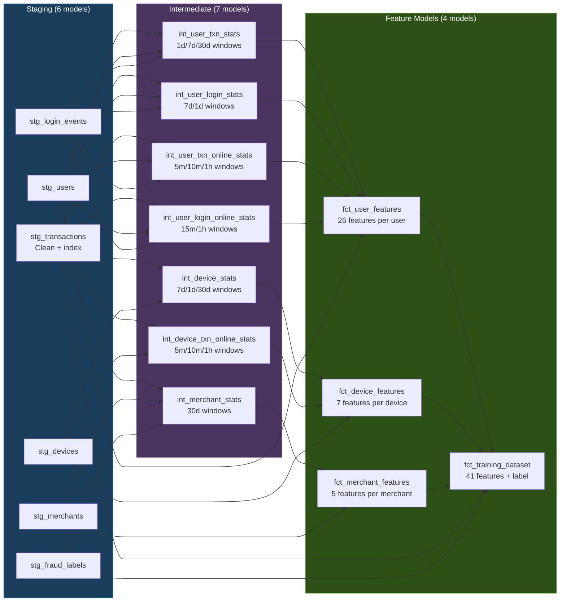
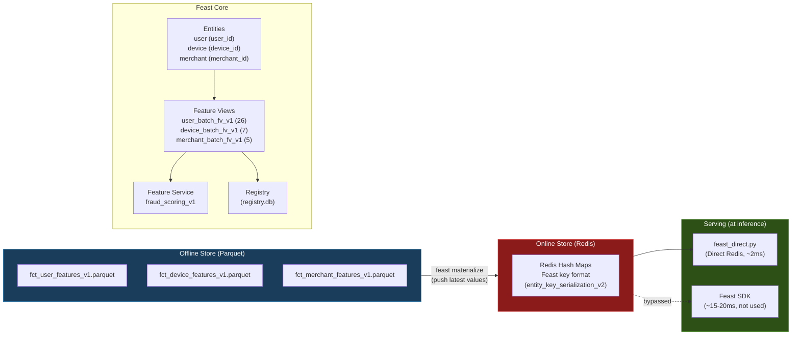
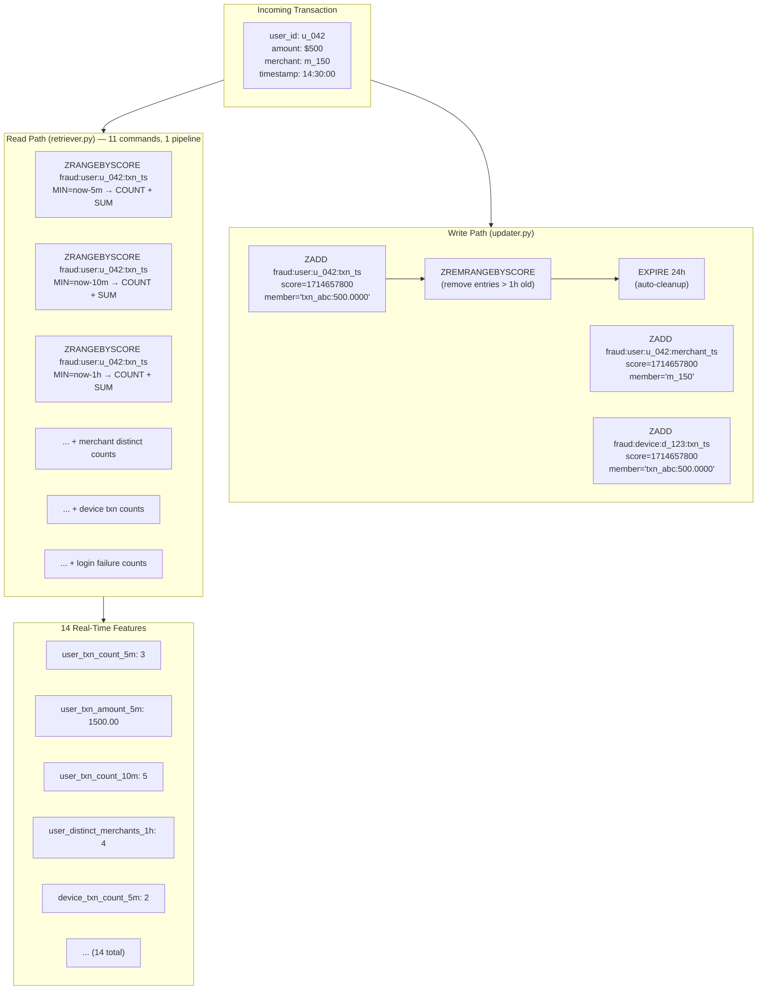
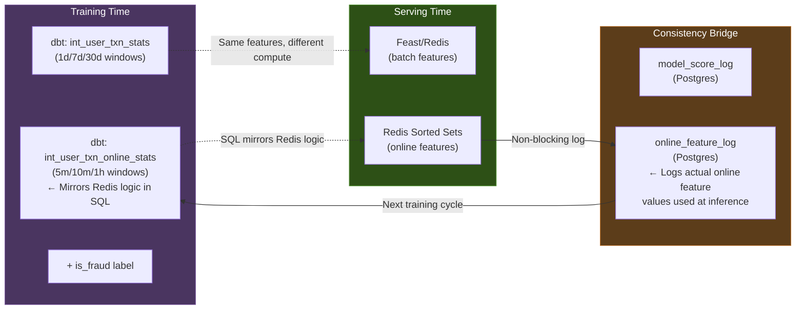

# Feature Engineering & Feature Store — Fraud Real-Time ML Prototype

## Overview

This platform implements a **dual-speed feature architecture** — the same pattern used by Stripe, PayPal, and other leading fraud detection systems:

| Speed | Staleness | Features | Source | Use Case |
|-------|-----------|----------|--------|----------|
| **Batch** | Hours | 24 features | dbt → Feast → Redis | User profiles, 1d/7d/30d aggregates |
| **Real-time** | Milliseconds | 14 features | Redis sorted sets (direct) | 5m/10m/1h sliding windows |
| **Request-time** | Zero | 3 features | HTTP request payload | Amount, is_international, local_hour |

**Total: 41 features** served in < 5ms via Redis.

---

## End-to-End Feature Pipeline

```mermaid
flowchart TD
    subgraph INGEST["Data Ingestion"]
        TXN_STREAM["Transaction Events<br/>(Real-Time Stream)"]
        TXN_HIST["Historical Transactions<br/>(Batch Load)"]
    end

    subgraph RAW["Raw Storage — PostgreSQL"]
        RAW_TXN["raw_transactions"]
        RAW_USERS["raw_users"]
        RAW_DEVICES["raw_devices"]
        RAW_MERCHANTS["raw_merchants"]
        RAW_LOGIN["raw_login_events"]
        RAW_LABELS["fraud_labels"]
    end

    subgraph EXPORT["Export Layer"]
        PG2DUCK["export_pg_to_duckdb.py<br/>(Full table copy)"]
        DUCK_RAW["DuckDB<br/>raw.* schema"]
    end

    subgraph DBT["dbt Feature Pipeline (DuckDB)"]
        STG["Staging Layer<br/>(6 models)<br/>stg_transactions<br/>stg_users<br/>stg_devices<br/>stg_merchants<br/>stg_fraud_labels<br/>stg_login_events"]
        INT["Intermediate Layer<br/>(7 models)<br/>int_user_txn_stats<br/>int_device_stats<br/>int_merchant_stats<br/>int_user_login_stats<br/>int_user_txn_online_stats<br/>int_device_txn_online_stats<br/>int_user_login_online_stats"]
        FCT["Feature Layer<br/>(4 models)<br/>fct_user_features<br/>fct_device_features<br/>fct_merchant_features<br/>fct_training_dataset"]
    end

    subgraph FEAST["Feast Materialization"]
        PARQUET["Parquet Files<br/>(3 feature tables)"]
        FEAST_SDK["feast materialize<br/>(Parquet → Redis)"]
    end

    subgraph REDIS_BATCH["Redis — Batch Features"]
        RF_USER["user_batch_fv_v1<br/>(26 features per user)"]
        RF_DEVICE["device_batch_fv_v1<br/>(7 features per device)"]
        RF_MERCHANT["merchant_batch_fv_v1<br/>(5 features per merchant)"]
    end

    subgraph REDIS_ONLINE["Redis — Real-Time Features"]
        RS_USER_TXN["fraud:user:{id}:txn_ts<br/>(Sorted Set)"]
        RS_USER_MERCH["fraud:user:{id}:merchant_ts<br/>(Sorted Set)"]
        RS_DEVICE_TXN["fraud:device:{id}:txn_ts<br/>(Sorted Set)"]
        RS_USER_LOGIN["fraud:user:{id}:login_fail_ts<br/>(Sorted Set)"]
    end

    TXN_STREAM -->|"updater.py<br/>(ZADD + EXPIRE)"| REDIS_ONLINE
    TXN_HIST --> RAW
    RAW --> PG2DUCK --> DUCK_RAW --> STG --> INT --> FCT
    FCT -->|"DuckDB → Parquet"| PARQUET --> FEAST_SDK --> REDIS_BATCH

    style INGEST fill:#5c3d1a,stroke:#b97029,color:#fff
    style RAW fill:#1a3d5c,stroke:#2980b9,color:#fff
    style DBT fill:#4a3560,stroke:#7d5da0,color:#fff
    style FEAST fill:#2d5016,stroke:#4a8c2a,color:#fff
    style REDIS_BATCH fill:#8b1a1a,stroke:#cd3333,color:#fff
    style REDIS_ONLINE fill:#8b1a1a,stroke:#cd3333,color:#fff
```



---

## Batch Feature Pipeline (dbt + DuckDB)

### Why dbt + DuckDB?

| Aspect | Benefit |
|--------|---------|
| **SQL-based** | Data engineers and analysts can contribute, no Python needed |
| **Version-controlled** | Features defined as SQL models, tracked in git |
| **Incremental** | Only process new/changed rows (not full recompute) |
| **DuckDB** | 10-100× faster than Postgres for OLAP, zero-config, columnar |
| **Testable** | dbt tests for schema validation, uniqueness, referential integrity |

### dbt Model Layers



### Point-in-Time Correctness

All intermediate models use **DuckDB RANGE window frames** to ensure no data leakage:

```sql
-- Example: int_user_txn_stats (simplified)
SELECT
    user_id,
    event_timestamp,
    COUNT(*) OVER (
        PARTITION BY user_id
        ORDER BY event_timestamp
        RANGE BETWEEN INTERVAL '7 days' PRECEDING
                  AND INTERVAL '1 microsecond' PRECEDING  -- excludes current row
    ) AS user_txn_count_7d
FROM stg_transactions
```

The `INTERVAL '1 microsecond' PRECEDING` upper bound ensures that the **current transaction's features only reflect past behavior** — critical for avoiding label leakage in training.

---

## Feast Feature Store

### Architecture



### Materialization Process

```bash
# scripts/materialize_features.py does:
# 1. Query DuckDB for latest feature values
# 2. Export to parquet files (data/duckdb/parquet/)
# 3. Feast reads parquet → pushes to Redis

make materialize   # Runs the full pipeline
```

Each entity gets the **most recent** feature row pushed to Redis. Old values are overwritten — Redis always has the latest snapshot.

### Feast vs Direct Redis

| Method | Latency | How |
|--------|---------|-----|
| Feast SDK `get_online_features()` | ~15-20ms | Python overhead, protobuf, type conversion |
| **Direct Redis (`feast_direct.py`)** | **~2ms** | Raw HMGET, custom protobuf decoder, pre-computed field hashes |

We use the Feast SDK for **materialization** (batch write) and our own `feast_direct.py` for **serving** (real-time read). Best of both worlds.

---

## Real-Time Features (Redis Sorted Sets)

### How Sliding Windows Work



### Sorted Set Data Model

| Redis Key Pattern | Score | Member | Windows |
|-------------------|-------|--------|---------|
| `fraud:user:{id}:txn_ts` | Unix timestamp | `{txn_id}:{amount:.4f}` | 5m, 10m, 1h |
| `fraud:user:{id}:merchant_ts` | Unix timestamp | `{merchant_id}` | 5m, 10m, 1h |
| `fraud:device:{id}:txn_ts` | Unix timestamp | `{txn_id}:{amount:.4f}` | 5m, 10m, 1h |
| `fraud:user:{id}:login_fail_ts` | Unix timestamp | `{event_id}` | 15m, 1h |

**Why Sorted Sets?**
- `ZRANGEBYSCORE` with timestamp range = O(log N + M) sliding window query
- Automatic deduplication by member
- `ZREMRANGEBYSCORE` for efficient cleanup
- 24h TTL ensures memory doesn't grow unbounded

### 14 Real-Time Features

| # | Feature | Source | Windows |
|---|---------|--------|---------|
| 1-3 | `user_txn_count_{5m,10m,1h}` | user txn sorted set | Count of entries |
| 4-6 | `user_txn_amount_{5m,10m,1h}` | user txn sorted set | Sum of amounts |
| 7-9 | `user_distinct_merchants_{5m,10m,1h}` | user merchant sorted set | Count distinct |
| 10-11 | `user_failed_logins_{15m,1h}` | user login sorted set | Count of failures |
| 12-14 | `device_txn_count_{5m,10m,1h}` | device txn sorted set | Count of entries |

---

## Feature Consistency: Training vs Serving



**Key insight**: The dbt `int_*_online_stats` models compute the **same** 5m/10m/1h sliding window features as Redis, but in SQL over historical data. This ensures the model is trained on features that match what it sees at serving time.

Additionally, every inference logs its actual online feature values to `online_feature_log`, creating a ground truth record for monitoring training-serving skew.

---

## Full Feature Catalog (41 Features)

### Request-Time Features (3)
| Feature | Type | Source |
|---------|------|--------|
| `txn_amount` | float | Request payload |
| `is_international` | bool | Request payload |
| `local_hour` | int (0-23) | Request payload (or derived) |

### User Batch Features (15) — via Feast/Redis
| Feature | Type | Window |
|---------|------|--------|
| `user_account_age_days` | int | — |
| `user_is_verified` | bool | — |
| `user_account_type` | str | — |
| `user_txn_count_{1d,7d,30d}` | int | Rolling |
| `user_txn_amount_{1d,7d,30d}` | float | Rolling |
| `user_distinct_merchants_{7d,30d}` | int | Rolling |
| `user_distinct_devices_30d` | int | Rolling |
| `user_decline_count_7d` | int | Rolling |
| `user_failed_logins_{7d,1d}` | int | Rolling |

### User Online Features (11) — via Redis Sorted Sets
| Feature | Type | Window |
|---------|------|--------|
| `user_txn_count_{5m,10m,1h}` | int | Sliding |
| `user_txn_amount_{5m,10m,1h}` | float | Sliding |
| `user_distinct_merchants_{5m,10m,1h}` | int | Sliding |
| `user_failed_logins_{15m,1h}` | int | Sliding |

### Device Features (7) — Batch (4) + Online (3)
| Feature | Type | Source |
|---------|------|--------|
| `device_distinct_users_30d` | int | Feast |
| `device_txn_count_{7d,1d}` | int | Feast |
| `device_is_shared_flag` | bool | Feast (derived) |
| `device_txn_count_{5m,10m,1h}` | int | Redis |

### Merchant Features (5) — via Feast/Redis
| Feature | Type | Window |
|---------|------|--------|
| `merchant_is_high_risk` | bool | — |
| `merchant_is_online` | bool | — |
| `merchant_txn_count_30d` | int | Rolling |
| `merchant_avg_ticket_30d` | float | Rolling |
| `merchant_fraud_rate_30d` | float | Rolling |

---

## Pipeline Commands

```bash
# Full offline pipeline (export → dbt → materialize)
make offline-pipeline

# Individual steps
make export-to-duckdb     # Postgres → DuckDB
make dbt-run              # Run dbt models
make materialize          # DuckDB → Parquet → Feast → Redis

# Feast management
make feast-apply          # Register/update feature views

# Stream real-time events to Redis
make stream-events        # Start transaction simulator
```
