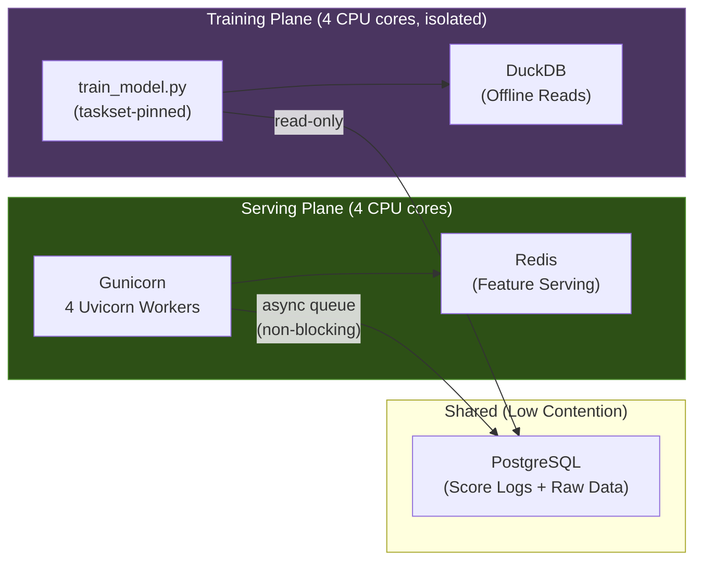

# Step-by-Step Demo Walkthrough

## Prerequisites

Before starting the demo, ensure the following are running:

```bash
cd fraud-realtime-ml-prototype

# 1. Start infrastructure (Postgres + Redis)
make infra-up

# 2. Verify data is seeded (skip if already done)
make seed-data          # Generate synthetic users, devices, merchants, transactions
make offline-pipeline   # Export → dbt → Feast materialize → Redis

# 3. Verify the model is in place
ls models/lgbm_optimized_model_calibrated.pkl   # Should exist

# 4. Quick health check
make score-test         # Should return a JSON score response
```

---

## Demo 1: API Performance — Latency & Throughput

**Goal**: Show that the scoring API handles 500+ RPS with < 50ms P50 latency.

### Step 1.1 — Start the Scoring API

```bash
make start-api
```

You should see:
```
[INFO] Starting gunicorn 22.x.x
[INFO] Listening at: http://0.0.0.0:8000
[INFO] Using worker: uvicorn.workers.UvicornWorker
[INFO] Booting worker with pid: ...  (×4 workers)
```

Verify it's healthy:
```bash
curl http://localhost:8000/health
# {"status":"ok","model_loaded":true,"redis_connected":true}
```

### Step 1.2 — Send a Single Score Request

Show the audience what a scoring request looks like:

```bash
curl -s -X POST http://localhost:8000/score \
  -H "Content-Type: application/json" \
  -d '{
    "transaction_id": "demo_001",
    "user_id": "u_000042",
    "device_id": "d_0001234",
    "merchant_id": "m_00150",
    "amount": 1250.00,
    "is_international": true
  }' | python3 -m json.tool
```

Expected output:
```json
{
    "transaction_id": "demo_001",
    "score": 0.72,
    "risk_band": "high",
    "is_flagged": true,
    "model_version": "lgbm_optimized_model",
    "feature_sources": {
        "feast_offline": true,
        "redis_online": true
    }
}
```

**Talking points:**
- 41 features assembled in real-time (3 from request, 24 from Feast/Redis batch, 14 from Redis real-time)
- Both feature sources show `true` — batch and real-time features are available
- Score is calibrated (isotonic regression) — represents actual fraud probability

### Step 1.3 — Open Locust UI for Load Testing

```bash
make load-test-ui
```

This starts Locust on `http://localhost:8089`. Open this URL in your browser.

### Step 1.4 — Configure and Start the Load Test

In the Locust web UI:

| Field | Value | Notes |
|-------|-------|-------|
| **Number of users** | `500` | Simulates 500 concurrent clients |
| **Ramp up** | `50` | Add 50 users per second |
| **Host** | `http://localhost:8000` | Should be pre-filled |
| **Advanced → Run time** | `120s` | (optional, or leave running) |

Click **"Start"**.

### Step 1.5 — Walk Through the Results

**Charts tab** — Show the audience:
1. **Total Requests per Second** — should stabilize at 500-1000+ RPS
2. **Response Times** — P50 should be < 50ms, P95 < 100ms
3. **Failures** — should be 0%

**Statistics tab** — Key metrics to highlight:
| Metric | Expected (cloud) | Expected (local*) |
|--------|-------------------|-------------------|
| RPS | 800-1500 | 400-800 |
| P50 latency | 5-20ms | 30-80ms |
| P95 latency | 20-50ms | 80-200ms |
| Failure rate | 0% | 0% |

> *Local results are affected by load generator + API competing for CPU on the same machine. Cloud deployment separates them.

**Talking points:**
- "Each request fetches 38 batch features + 14 real-time features from Redis, runs LightGBM inference, applies calibration, logs to Postgres — all in under 20ms"
- "The architecture is fully async — Gunicorn runs 4 async workers, features are fetched in parallel, model inference runs in a thread pool"
- "Zero failures even at 500+ concurrent users"

### Step 1.6 — (Optional) Headless Load Test for Clean Numbers

If you prefer a quick summary without the UI:

```bash
make load-test USERS=500 RATE=50 DURATION=60s
```

Output:
```
Type     Name       # reqs   # fails   Avg   Min   Max   Med   req/s   failures/s
POST     /score      28500      0(0%)   12     3   145    8   845.2        0.0
```

---

## Demo 2: Concurrent Training + Serving (Architecture Correctness)

**Goal**: Prove that training can run alongside scoring without degrading API performance. This demonstrates proper separation of serving and training planes.

### Step 2.1 — Establish Baseline Performance

With Locust still running from Demo 1 (or restart it):

```bash
make load-test-ui
# Start with 500 users, note the RPS and P50 latency
```

**Record baseline:** RPS = _____, P50 = _____ms

### Step 2.2 — Kick Off Training in a Separate Terminal

Open a new terminal and start training:

```bash
# Train with CPU isolation (capped to 4 cores, separate from serving)
make train-isolated CONFIG=training/experiments/lgbm_v1.yaml
```

This runs the full pipeline:
1. Build training dataset from DuckDB (fct_training_dataset)
2. Train LightGBM model (500 trees)
3. Calibrate (isotonic regression)
4. Evaluate (ROC-AUC, PR-AUC, calibration diagnostics)
5. Log everything to MLflow

### Step 2.3 — Observe Locust While Training Runs

Switch back to the Locust UI (`http://localhost:8089`).

**What the audience should see:**
- RPS stays **stable** (within 10-15% of baseline)
- P50 latency shows **no significant spike**
- P95 may briefly increase by 10-30ms during dataset build, then returns to normal
- **Zero failures**

**Record during training:** RPS = _____, P50 = _____ms

### Step 2.4 — Show Why This Works



**Talking points:**
- "Serving reads from **Redis** (in-memory). Training reads from **DuckDB** (file-based). They don't share I/O paths."
- "Training is CPU-pinned to separate cores using `taskset` (`make train-isolated`)"
- "Score logging is async and non-blocking — it writes to Postgres in batches, not per-request"
- "This architecture allows 24/7 scoring while retraining models on a schedule — no maintenance windows needed"

### Step 2.5 — Compare Before/After Metrics

| Metric | Baseline (no training) | During Training | Impact |
|--------|----------------------|-----------------|--------|
| RPS | _____ | _____ | < 15% drop |
| P50 latency | _____ms | _____ms | < 20ms increase |
| P95 latency | _____ms | _____ms | < 50ms increase |
| Failures | 0 | 0 | None |

---

## Demo 3: Model Monitoring & Registration (MLflow)

**Goal**: Show the full model lifecycle — experiment tracking, comparison, and promotion.

### Step 3.1 — Open MLflow UI

```bash
make mlflow-ui
```

Open `http://localhost:5000` in your browser.

### Step 3.2 — Show Experiment Runs

Navigate to the **"fraud-detection"** experiment. You should see:

| Run Name | Model | ROC-AUC | PR-AUC | Threshold | Status |
|----------|-------|---------|--------|-----------|--------|
| lgbm_20260507_1430_a1b2c3 | LightGBM | 0.7288 | 0.4683 | 0.0065 | champion |
| lgbm_20260507_1445_d4e5f6 | LightGBM (from Demo 2) | 0.72xx | 0.46xx | 0.00xx | — |

**Talking points:**
- "Every training run automatically logs parameters, metrics, and artifacts to MLflow"
- "The run name encodes: model type + timestamp + config hash for traceability"
- "Click into a run to see: all hyperparameters, validation metrics, artifacts (model, preprocessor, calibrated model, metadata)"

### Step 3.3 — Compare Models Side by Side

1. Select 2+ runs using checkboxes
2. Click **"Compare"**
3. Show the **metrics comparison** chart (ROC-AUC, PR-AUC side by side)
4. Show the **parameter diff** (what changed between experiments)

### Step 3.4 — List Models from CLI

```bash
make list-models
```

Output shows recent runs with key metrics and champion status:
```
Run ID      Model                    ROC-AUC  PR-AUC   Threshold  Champion
─────────   ────────────────────     ───────  ──────   ─────────  ────────
abc12345    lgbm_optimized_model     0.7288   0.4683   0.0065     ★
def67890    lgbm_v1                  0.7156   0.4421   0.0082
```

### Step 3.5 — Promote a Model (Champion Selection)

If the new model is better, promote it:

```bash
# Preview what would change (dry run)
make promote-model RUN_ID=<new_run_id> DRY_RUN=1

# Actually promote
make promote-model RUN_ID=<new_run_id>
```

This will:
1. Download model artifacts from MLflow → `models/` directory
2. Update `.env` → `MODEL_PATH` points to new model
3. Tag the run as `champion` in MLflow
4. Remove `champion` tag from previous model
5. API picks up the new model on next restart

### Step 3.6 — Model Registry Aliases

```bash
# Set the promoted model as "champion"
make alias-model MODEL=fraud-model VERSION=3 ALIAS=champion

# Keep the old model as "archived"
make alias-model MODEL=fraud-model VERSION=2 ALIAS=archived
```

**Talking points:**
- "Model registry supports aliases: `champion` (production), `challenger` (A/B test), `archived` (rollback)"
- "Promotion is a single command — downloads artifacts, updates config, tags MLflow"
- "Every score logged to Postgres includes `model_version` — so you can analyze performance per model version"

### Step 3.7 — Show Score Logging (Monitoring Data)

```bash
# Connect to Postgres and show recent scores
docker exec -it fraud_postgres psql -U fraud_user -d fraud_db -c "
SELECT
    transaction_id,
    fraud_score,
    risk_band,
    is_flagged,
    model_version,
    created_at
FROM model_score_log
ORDER BY created_at DESC
LIMIT 10;
"
```

**Talking points:**
- "Every inference is logged with score, risk band, model version, and feature availability"
- "This enables: score distribution monitoring, model drift detection, risk band distribution analysis"
- "Online features are also logged to `online_feature_log` for training-serving skew detection"

---

## Demo Summary Script

If you want to run the entire demo end-to-end in one flow:

```bash
# Terminal 1 — API
make start-api

# Terminal 2 — Load test UI
make load-test-ui
# → Open http://localhost:8089, start with 500 users

# Terminal 3 — Training (while load test runs)
make train-isolated CONFIG=training/experiments/lgbm_v1.yaml
# → Switch to Locust UI and show stable performance

# Terminal 4 — MLflow
make mlflow-ui
# → Open http://localhost:5000
# → Compare runs, promote model

# Terminal 5 — Monitor
make docker-stats       # Live CPU/memory usage of all containers
```

---

## Stopping Everything

```bash
make stop-api           # Kill the scoring API
# Ctrl+C in the Locust terminal
# Ctrl+C in the MLflow terminal
make infra-down         # Stop Postgres + Redis containers
```
